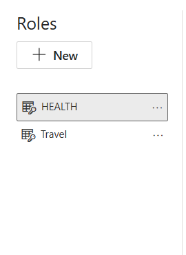
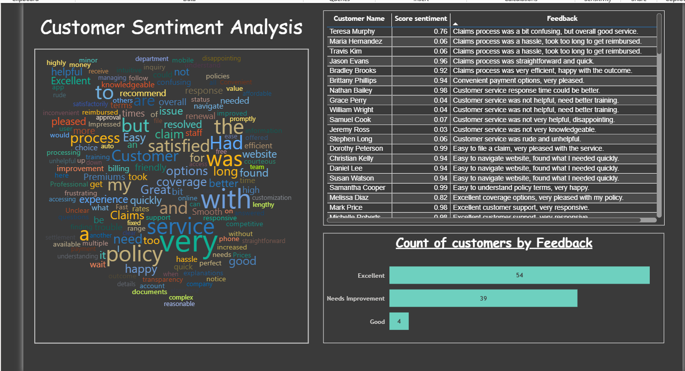

# 💼 Rubic Insurance Pvt. Ltd. – Power BI Dashboard  

## 📊 Project Overview  
This Power BI project focuses on **analyzing Rubic Insurance Pvt. Ltd. performance metrics**, including sales, customer engagement, sentiment distribution, and health insurance trends.  
The dashboard was built to provide **real-time insights** into organizational operations and help management make data-driven decisions.  

The project showcases my skills in:
- Data cleaning and transformation using **Power Query**  
- Building **interactive dashboards** and **DAX-based KPIs**  
- Designing **role-based access** in Power BI service  
- Implementing **scheduled refresh** and **dataset management**  
- Performing **sentiment analysis** on textual feedback  

---

## 🧭 Dashboard Snapshots  

### 1️⃣ Main Dashboard View  
Provides an overall picture of **policy sales, customer distribution, and key performance indicators**.  

---

### 2️⃣ Roles & Access Setup  
Implemented **role-level security (RLS)** to provide different access views for Admin, Manager, and Analyst roles within the Power BI Service.  

---

### 3️⃣ Sentiment Analysis View  
This report visualizes **customer feedback polarity (positive, neutral, negative)** using sentiment scoring techniques and Power BI visuals.  

---

### 4️⃣ Viewing as "Health" Role  
A demonstration of Power BI’s **role-based filtering** — here showing how the dashboard adapts dynamically when viewed under the **Health department role**.  

---

## ⚙️ Key Features  

| Feature | Description |
|----------|-------------|
| **Data Source** | Excel & CSV files containing policy data, customer details, and feedback |
| **Data Cleaning** | Performed using Power Query Editor |
| **Modeling** | Star schema model with measures built in DAX |
| **Visualization** | KPI cards, donut charts, bar graphs, slicers, and sentiment visuals |
| **RLS Implementation** | Role-based views (Health, Vehicle, and Life Insurance roles) |
| **Publishing** | Dashboard published to **Power BI Service** |
| **Automation** | Implemented **Scheduled Refresh** for data synchronization |
| **Testing** | Validated visuals for accuracy and interactivity |
| **Cloud Features** | Shared dashboard securely with stakeholders |

---

## 💡 Insights Derived  

1. **Health Insurance** policies generated the highest customer satisfaction scores.  
2. **Negative feedback** was mainly tied to claim processing delays.  
3. Sales peaked during **Q2 and Q4**, indicating seasonal marketing influence.  
4. Role-based dashboards improved **data confidentiality and accessibility**.  
5. Automated refresh schedules improved **report reliability**.  

---

## 🧠 Tools & Technologies Used  

- **Microsoft Power BI Desktop**
- **Power BI Service**
- **Power Query Editor**
- **DAX (Data Analysis Expressions)**
- **Excel (Data Source)**
- **Microsoft Fabric / Power BI Gateway** (for refresh scheduling)

---

## 📈 Skills Demonstrated  

- Data Modeling and ETL using Power Query  
- DAX formula creation for calculated columns & measures  
- Advanced Visualization Techniques  
- Role-Level Security (RLS) in Power BI  
- Dashboard Publishing & Sharing  
- Report Performance Optimization  

---

## 🔄 Publishing & Collaboration  

After creating and testing the dashboard in Power BI Desktop:
- Published the report to **Power BI Service**  
- Configured **RLS roles** and tested using “View as Role” feature  
- Created **Scheduled Refreshes** to ensure updated data  
- Shared reports with team members using **workspace permissions**  

---

## 🧭 Future Enhancements  

- Integration with **Azure Synapse Analytics** for large datasets  
- Use of **Python/R scripts** inside Power BI for predictive analysis  
- Implement **email alerts** using Power Automate for KPI deviations  

---

## 🏁 Conclusion  

This project demonstrates how Power BI can transform raw insurance data into actionable insights.  
The dashboard not only simplifies monitoring across multiple departments but also enhances **decision-making efficiency** with interactive analytics and secure access controls.  

---

### 📷 Dashboard Snapshots Summary  

| View | Screenshot |
|------|-------------|
| Main Dashboard |  |
| Roles Setup |  |
| Sentiment Analysis |  |
| Viewing as Health |  |

---

### 👨‍💻 Developed By  
Adithya S
_Data Analyst | Power BI | SQL | Python_  
📧 adiskashyap4444@gmail.com
🔗 [[LinkedIn Profile](https://www.linkedin.com/in/adithya-s-125a3a25b)] | [GitHub Repository]
